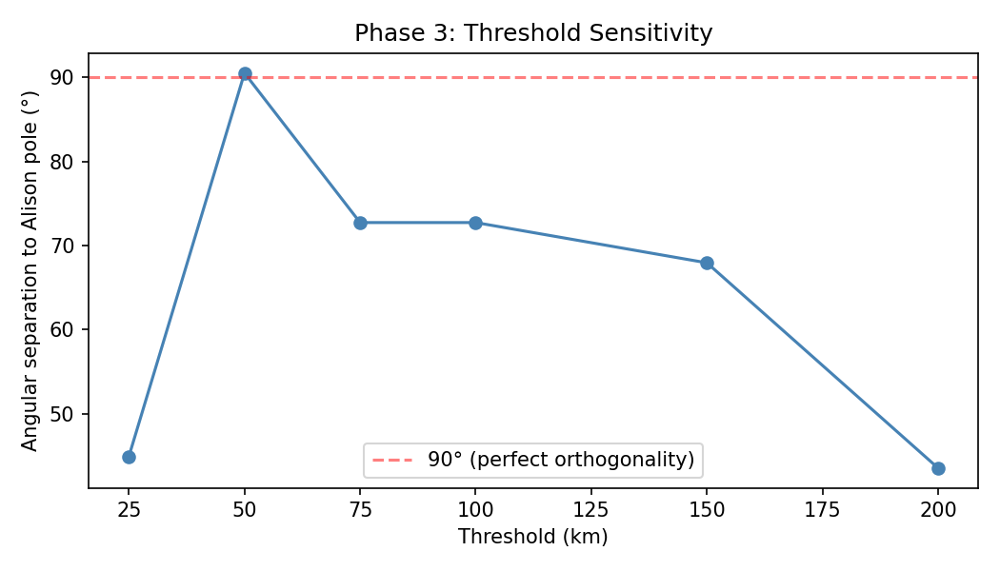
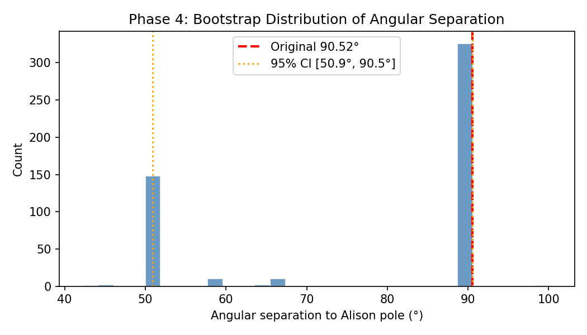
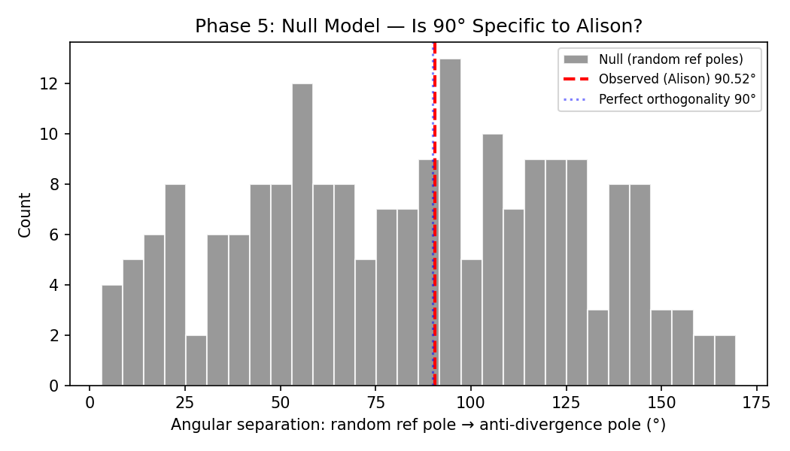

# Test B1: Anti-Divergence Fine Grid + Orthogonality Hardening
**Date:** 2026-03-22  **Seed:** 42

## Phase 1: Fine Grid Scan (2° × 4°)
Scanned 4,186 poles.
| Metric | Pole | Value | n_mon | n_sett | Ang Sep to Alison |
|--------|------|-------|-------|--------|-------------------|
| metric_A | (30°N, -48°E) | 81.00 | 1 | 81 | 64.74° |
| metric_B | (52°N, -152°E) | 1511.00 | 610 | 2121 | 10.70° |
| metric_C | (0°N, -104°E) | 1.00 | 0 | 1 | 65.46° |

All 3 metrics converge to same pole? **False**

## Phase 2: Local Optimization (0.5° steps)
| Metric | Refined Pole | Value | Ang Sep |
|--------|-------------|-------|--------|
| metric_A | (31.5°N, -51.5°E) | 84.00 | 61.81° |
| metric_B | (52.5°N, -156.0°E) | 1560.00 | 12.00° |
| metric_C | (0.0°N, -104.0°E) | 1.00 | 65.46° |

## Phase 3: Threshold Sensitivity
| Threshold (km) | Pole | metric_A | Ang Sep |
|----------------|------|----------|--------|
| 25 | (25°N, -180°E) | 66.00 | 44.91° |
| 50 | (10°N, -30°E) | 72.00 | 90.52° |
| 75 | (35°N, -20°E) | 44.00 | 72.73° |
| 100 | (35°N, -20°E) | 67.00 | 72.73° |
| 150 | (25°N, -50°E) | 51.00 | 67.94° |
| 200 | (50°N, -60°E) | 51.00 | 43.52° |

## Phase 4: Bootstrap CI (500 iterations)
- Median angular separation: **90.52°**
- Mean: 77.28° ± 18.41°
- 95% CI: **[50.88°, 90.52°]**

## Phase 5: Null Model for Orthogonality (CRITICAL TEST)
200 random reference poles (uniform on upper hemisphere).
For each, found the anti-divergence pole from real data, then computed angular separation.

- Null mean: **83.52°**
- Null median: 86.33°
- Null std: 41.65°
- P(null ≥ 90.52°): 0.4650
- P(|null - 90°| ≤ 0.52°): 0.0100

**Interpretation:** GEOMETRIC TRUISM: Random reference poles also yield ~90° separations to the anti-divergence pole. Orthogonality is NOT specific to Alison.

