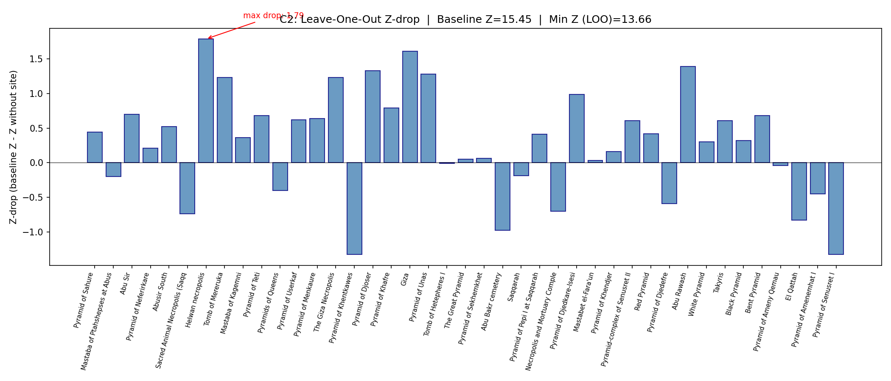

# C2: Leave-One-Out Stability for Mortuary Signal

## Purpose
Test whether the mortuary corridor signal (Z~25) is driven by a few
influential sites, or remains robust when any site is removed.

## Baseline
- Total mortuary sites in Pleiades: 1568
- Pre-2000 BCE mortuary sites: 150
- On-corridor (<=50 km): 41
- MC (200 trials): mean=6.21, std=2.25
- **Baseline Z = 15.45**

## Leave-One-Out Results
- Sites tested: 41
- **Min Z across all removals: 13.66**
- Max Z-drop: 1.79 (most influential: Helwan necropolis)

| # | Site | Lat | Lon | Type | minDate | Dist(km) | Z w/o | Z-drop |
|---|------|-----|-----|------|---------|----------|-------|--------|
| 1 | Pyramid of Sahure | 29.898 | 31.205 | pyramid | -2670 | 3.1 | 15.01 | +0.44 |
| 2 | Mastaba of Ptahshepses at Abusir | 29.897 | 31.205 | tomb | -2670 | 3.2 | 15.65 | -0.20 |
| 3 | Abu Sir | 29.896 | 31.204 | cemetery | -2670 | 3.3 | 14.75 | +0.70 |
| 4 | Pyramid of Neferirkare | 29.895 | 31.202 | pyramid | -2670 | 3.4 | 15.24 | +0.21 |
| 5 | Abusir South | 29.883 | 31.210 | cemetery | -2670 | 4.7 | 14.93 | +0.52 |
| 6 | Sacred Animal Necropolis (Ṣaqqārah) | 29.882 | 31.215 | cemetery | -4500 | 5.0 | 16.19 | -0.74 |
| 7 | Helwan necropolis | 29.884 | 31.295 | cemetery | -2950 | 5.4 | 13.66 | +1.79 |
| 8 | Tomb of Mereruka | 29.876 | 31.221 | tomb | -2670 | 5.7 | 14.22 | +1.23 |
| 9 | Mastaba of Kagemni | 29.876 | 31.221 | tomb | -2670 | 5.7 | 15.09 | +0.36 |
| 10 | Pyramid of Teti | 29.875 | 31.222 | pyramid | -2670 | 5.7 | 14.76 | +0.68 |
| 11 | Pyramids of Queens | 29.972 | 31.128 | pyramid | -2670 | 5.8 | 15.85 | -0.40 |
| 12 | Pyramid of Userkaf | 29.874 | 31.219 | pyramid,tomb | -2670 | 5.9 | 14.83 | +0.62 |
| 13 | Pyramid of Menkaure | 29.973 | 31.129 | pyramid | -2670 | 5.9 | 14.81 | +0.64 |
| 14 | The Giza Necropolis | 29.973 | 31.130 | cemetery | -2670 | 5.9 | 14.22 | +1.23 |
| 15 | Pyramid of Khentkawes | 29.974 | 31.136 | pyramid | -2670 | 5.9 | 16.78 | -1.33 |
| 16 | Pyramid of Djoser | 29.871 | 31.217 | pyramid | -2670 | 6.2 | 14.12 | +1.33 |
| 17 | Pyramid of Khafre | 29.977 | 31.130 | pyramid | -2670 | 6.3 | 14.66 | +0.79 |
| 18 | Giza | 29.978 | 31.132 | cemetery,pyramid,tomb | -2670 | 6.4 | 13.84 | +1.61 |
| 19 | Pyramid of Unas | 29.868 | 31.215 | pyramid | -2670 | 6.5 | 14.17 | +1.28 |
| 20 | Tomb of Hetepheres I | 29.979 | 31.136 | tomb | -2670 | 6.5 | 15.46 | -0.01 |
| 21 | The Great Pyramid | 29.979 | 31.134 | pyramid | -2670 | 6.5 | 15.39 | +0.05 |
| 22 | Pyramid of Sekhemkhet | 29.866 | 31.214 | pyramid | -2670 | 6.7 | 15.39 | +0.06 |
| 23 | Abu Bakr cemetery | 29.982 | 31.127 | cemetery | -2670 | 6.9 | 16.43 | -0.98 |
| 24 | Saqqarah | 29.862 | 31.219 | cemetery | -2950 | 7.1 | 15.64 | -0.19 |
| 25 | Pyramid of Pepi I at Saqqarah | 29.855 | 31.219 | pyramid,tomb | -2670 | 8.0 | 15.04 | +0.41 |
| 26 | Necropolis and Mortuary Complex of  | 29.854 | 31.219 | cemetery,pyramid | -2670 | 8.0 | 16.15 | -0.70 |
| 27 | Pyramid of Djedkare-Isesi | 29.851 | 31.221 | pyramid | -2670 | 8.4 | 14.46 | +0.99 |
| 28 | Mastabet el-Fara'un | 29.835 | 31.215 | tomb | -2670 | 10.1 | 15.42 | +0.03 |
| 29 | Pyramid of Khendjer | 29.832 | 31.224 | pyramid,tomb | -2010 | 10.5 | 15.29 | +0.16 |
| 30 | Pyramid-complex of Senusret III | 29.819 | 31.226 | pyramid,tomb | -2010 | 12.0 | 14.84 | +0.61 |
| 31 | Red Pyramid | 29.809 | 31.206 | pyramid | -2670 | 13.0 | 15.03 | +0.42 |
| 32 | Pyramid of Djedefre | 30.033 | 31.074 | tomb | -2670 | 13.0 | 16.03 | -0.59 |
| 33 | Abu Rawash | 30.034 | 31.079 | cemetery | -2670 | 13.1 | 14.06 | +1.39 |
| 34 | White Pyramid | 29.806 | 31.224 | pyramid | -2010 | 13.4 | 15.15 | +0.30 |
| 35 | Takyris | 29.800 | 31.217 | cemetery | -2670 | 14.0 | 14.84 | +0.61 |
| 36 | Black Pyramid | 29.792 | 31.224 | pyramid | -2010 | 15.0 | 15.13 | +0.32 |
| 37 | Bent Pyramid | 29.790 | 31.209 | pyramid,tomb | -2670 | 15.0 | 14.77 | +0.68 |
| 38 | Pyramid of Ameny Qemau | 29.782 | 31.222 | pyramid | -2010 | 16.1 | 15.49 | -0.04 |
| 39 | El Qattah | 30.217 | 30.967 | cemetery | -2010 | 34.3 | 16.28 | -0.83 |
| 40 | Pyramid of Amenemhat I | 29.575 | 31.225 | pyramid | -2010 | 39.0 | 15.90 | -0.45 |
| 41 | Pyramid of Senusret I | 29.560 | 31.221 | pyramid | -2010 | 40.6 | 16.78 | -1.33 |

## Leave-Five-Out Results
- Iterations: 1000
- MC trials per iteration: 100
- Median Z: 14.22
- Min Z: 11.40, Max Z: 18.38
- **Fraction with Z > 3: 100.0%**
- **Fraction with Z > 2: 100.0%**

## Verdict
**PASS -- Signal is highly robust to site removal**

