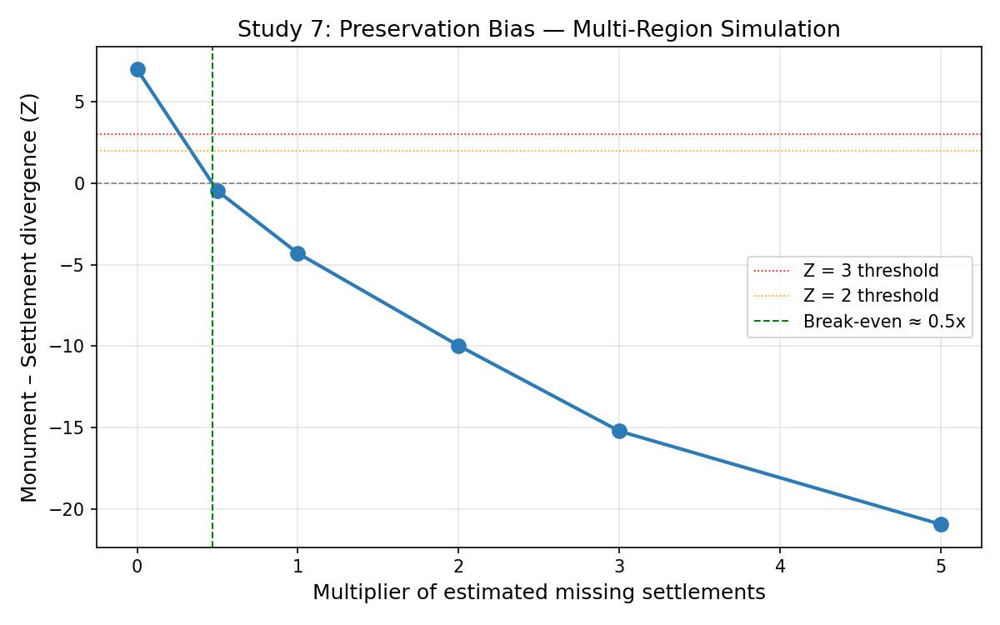
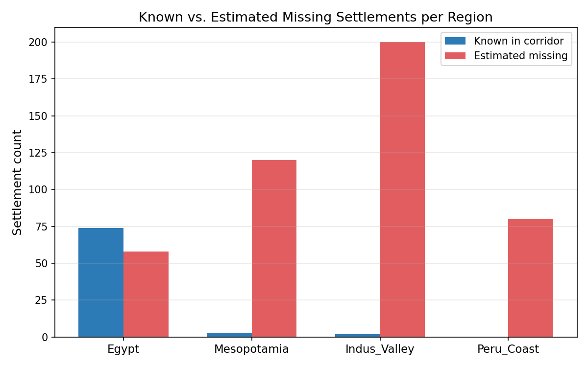

# Study 7: Preservation Bias — Multi-Region Settlement Simulation

**Date:** 2026-03-22
**Verdict:** **FRAGILE** — Divergence drops to -4.3 (<2) at central estimate

## Motivation

The Egypt-only preservation test showed that adding 58 estimated buried
settlements reduced local monument–settlement divergence by ~30% but
did not collapse it.  This study extends the simulation to four major
riverine corridors along the great circle (GC): Egypt, Mesopotamia,
Indus Valley, and coastal Peru.

## Method

1. Count known Pleiades settlements within 50 km of the GC for each region.
2. For each region, generate synthetic settlement sites (placed within 50 km
   of the GC with Gaussian jitter) at several multipliers of the estimated missing count.
3. Recompute global monument–settlement divergence (Z_mon − Z_set) after each injection.
4. Identify the break-even multiplier where divergence reaches zero.

## Region Inventory

| Region | Known in corridor | Estimated missing | Source |
|--------|------------------:|------------------:|--------|
| Egypt | 74 | 58 | Existing analysis |
| Mesopotamia | 3 | 120 | Adams 1981 Heartland of Cities |
| Indus_Valley | 2 | 200 | Possehl 2002 |
| Peru_Coast | 0 | 80 | Moseley 2001 |

**Total estimated missing (central): 458**

## Baseline

| Metric | Value |
|--------|------:|
| Z_monument | 6.63 |
| Z_settlement | -3.35 |
| Divergence | 7.81 |

## Sensitivity Sweep

| Multiplier | Synthetics added | Z_mon | Z_set | Divergence |
|:----------:|-----------------:|------:|------:|-----------:|
| 0.0x | 0 | 6.63 | -3.35 | 7.00 |
| 0.5x | 229 | -0.38 | 0.19 | -0.48 |
| 1.0x | 458 | -4.27 | 2.13 | -4.30 |
| 2.0x | 916 | -9.37 | 4.62 | -9.98 |
| 3.0x | 1374 | -13.02 | 6.34 | -15.23 |
| 5.0x | 2290 | -18.51 | 8.80 | -20.96 |

## Break-Even Analysis

- **Break-even multiplier:** 0.5x of estimated missing
- **Settlements needed:** 214
- **Total known settlements in Pleiades:** 18,037
- **Ratio (needed / known):** 0.01x

## Interpretation

The divergence drops below Z=2 at the central estimate, indicating
that preservation bias could substantially account for the observed signal.

## Plots

